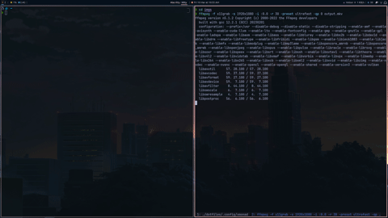
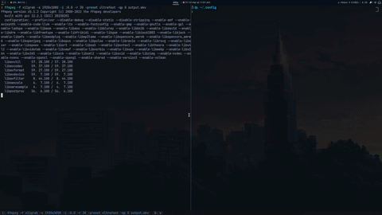

# Xmonad Config

My Personal Xmonad config with polybar as status bar.

## Features

- Window Minimize ([using polywins](https://github.com/tam-carre/polywins))

  

- Proper Fullscreen support

  

<detail>

<summary> Notes </summary>
```bash
git clone --depth 1 "https://github.com/xmonad/xmonad" xmonad-git
git clone --depth 1 "https://github.com/xmonad/xmonad-contrib" xmonad-contrib-git
git clone --depth 1 --single-branch --branch "v1.2.27" "https://github.com/rblaze/haskell-dbus" xmonad-contrib-git
yay -S --needed ncurses5-compat-libs
stack install
xmonad --recompile; xmonad --restart
```
</detail>
